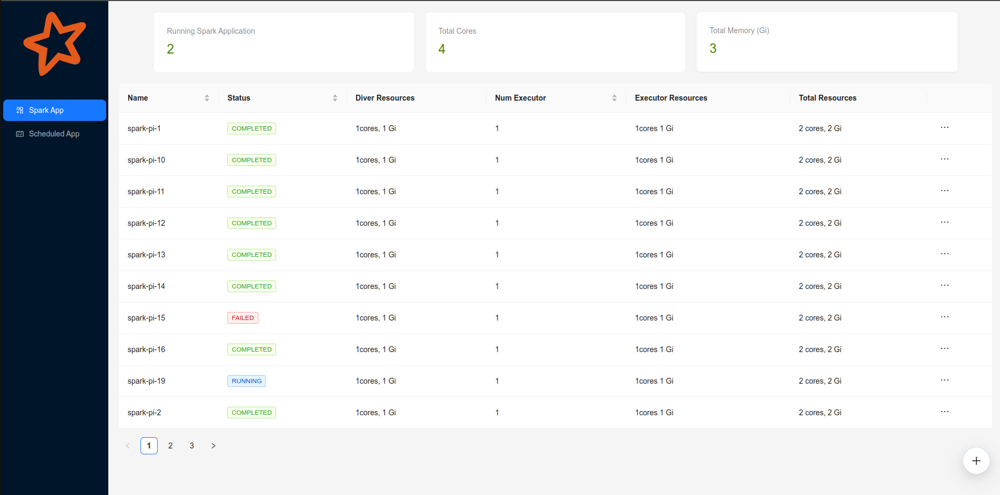

# Spark On K8s Admin
This project provides a web UI for managing Spark applications and scheduled Spark applications deployed using the SparkOnK8sOperator.




### Features
* Listing applications
* CRUD spark applications
* SparkUI: To enable the Spark UI, add this configuration to your Spark application.
```` yaml
spec:
  sparkConf:
    spark.ui.enabled: "true"
    spark.ui.proxyBase: /sparkui/<your application name>
    spark.ui.proxyRedirectUri: /
````


### Install guide
````bash
$ helm repo add spark-on-k8s-admin https://vcgbao.github.io/spark-on-k8s-admin/

$ helm install spark-admin -n spark-on-k8s-admin -f values.yaml
````
Example `values.yaml` file

````yaml
sparkOnK8sAdmin:
  port: 80
  spark:
    namespace: "spark-job"
  k8s:
    inCluster: true
ingress:
  enabled: true
  className: "nginx"
  hosts:
    - host: sparkadmin.local
      paths:
        - path: /
          pathType: ImplementationSpecific

````

### Inspiration and Code Attribution
This project incorporates code from the Spark UI Reverse Proxy project by DataPunch (https://github.com/datapunchorg/spark-ui-reverse-proxy). The original code is licensed under the Apache License 2.0.